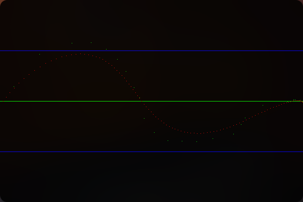
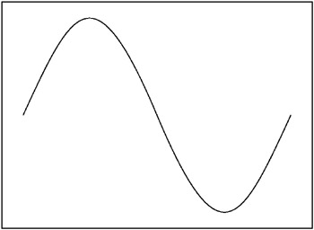
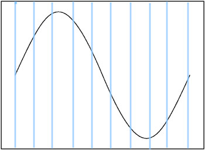

# WaveMaker
Synthesizes musical notes using **Pulse Code Modulation**,
    using custom waveform provided by user, using **Haskell** and **SDL2**

Click Below for Video

[](https://www.youtube.com/watch?v=Kq98aiAKKmE)


## How to Build?
```
stack build # Installs all dependencies
stack install # Installs the package locally
stack run # Runs the built executable
```

## What is PCM?
According to [wikipedia](https://en.wikipedia.org/wiki/Pulse-code_modulation):
> Pulse-code modulation (PCM) is a method used to digitally represent sampled analog signals

### What does that actually do?
Consider we have an initial signal.

 

In order to digitally store this, we have to sample this signal at regular intervals, at some **sampling rate**, and store these samples.

In a sound of **length** `t` seconds, the number of samples played are `t * sampleRate`.

The **volume** can be controlled by Amplitude of the samples. 
Sound `S` with `n` samples becomes a quieter sound `S'`, which has 10 percent the volume.

`S {s1, s2 .... sn } -> S' { 0.1 * s : s <- S }`.

**Pitch** of the sound is controlled by adjusting the distance between the samples being played.
What this means is, for a sound of `w` hertz, the code looks like so:

```
S: Samples (List of Float) 
N: Num Samples
W: Frequency we want to produce

wFrequencyWave = [ A * S[ i*W % N ] where i is an integer (0, UpperLim) ]
```

By Changing `UpperLim`, we change the **duration** of the sound wave.

By Changing `A` we change the volume of the sound wave.

**This is the logic with which sounds are produced, and can be found [here](./src/PCM/Player.hs), in the function note**

## How to go from A, B, C, D to Hz
According to [this](https://pages.mtu.edu/~suits/NoteFreqCalcs.html)

Any note can be generated using 
```
freq' = freq * (2 ^ ( N / 12 ))
```

Simple explanation:
1. 1 Octave, range of tones between any note and it's next harmonic, such that ratio is 2:1
2. In an Octave, there are 12 Semitones
3. If we start at freq = A = 440hz, and move N from 0 to 12, we generate the higher semitones.
4. freq = A = 440, N = [0,1,2,3,4,5,6,7] -> A, A#, B, C, C#, D, D#, E

**This is the logic with which pitches of notes are calculated [here](./src/PCM/Player.hs) in the function semitone**

## Limitations?
Yes. There are.

Because of the **Nyquist Rate**, the highest pitch we can generate by sampling, is **half of the sampling rate**.

This means, if I want to generate a pitch of 10000Hz, I must have atleast 20000 samples to pick from in a single period of the signal.

When you use the default **sin** function given in most math libraries for this, it's a trivial point you can ignore and move on.

When you try to draw your own waveform, this becomes very relevant.

## How to create a custom WaveForm?
A major part of music which people forget is the **timbre**, or rather the voice.
Two people can produce the same pitch B, but the shape of their voice has different waveforms.

We can use this project to produce any number of different voices by changing the waveform.

Below we describe how to recieve it as input and represent it efficiently

### Naively
The initial idea was to simply create a simple window in [SDL](https://www.libsdl.org/),
and code it up draw the curve, point by point.

The Algorithm:
```
1. Create window of W x H
2. Create a Vector of length W, with initial value 0
3. When a point (x,y) is clicked on the window,
4. Transform (x,y) from SDL coordinate system to (x, (y-h/2) / (h/2))
        this will constraint y value between -1 and 1.
5. Each X can have only single Y.
6. Window keeps taking mouse input until `Q` Pressed.
7. When Q pressed, we have W samples of some custom waveform
```

This gives problems because of the following reasons.
1. W is constrainted to size of your display, usually 1920pixels.
2. According to **Nyquist Rate**, highest pitch that this method can make would be 960Hz, 
    which is lesser than the pitch a grand piano can produce.
3. Also, because of the way sample is input, signal is very noisy.
4. Signal can be smoothened using **Discrete Time Fourier Series** of input signal, but the limitation
by **Nyquist Rate** still persists.

**This logic is implemented [here](./src/Sample/Discrete/Input.hs)**

### With Bezier Curves
Using Bezier curves, we can define a continuous line using a set of **Control Points**

This looks something like


The curve will necessarily pass through first and last points, and the rest of the points
control the direction and sharpness of the curves.

And by using this equation, using discrete points, we can create a continuous source to sample from.

This means the sample rate can be as high as we need it do be. 

We are now limited by the efficiency of the program than the quality of the algorithm.

The algorithm used to represent beziers is the [De Casteljau Algorithm](https://en.wikipedia.org/wiki/De_Casteljau%27s_algorithm)

**This logic is implemented [here](./src/Sample/Bezier/Input.hs)**